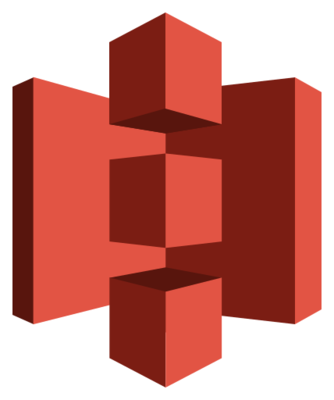
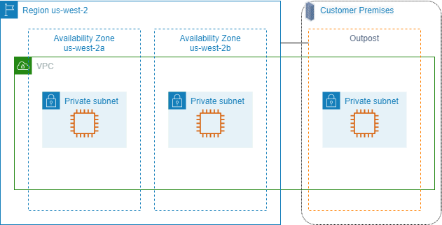
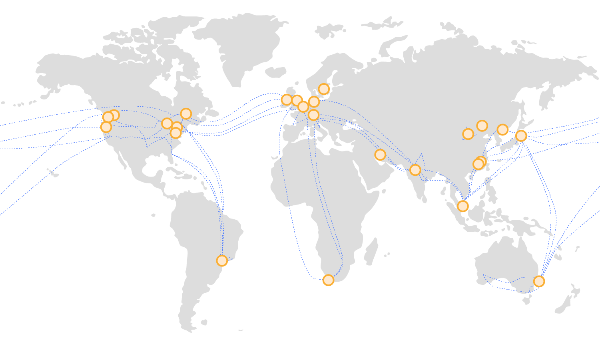

# Kriterien von Speichern

Speicher kann nach folgenden Kriterien kategorisiert werden:

- Zugriffsgeschwindigkeit
- Kapazität
- Kosten

Als Faustregel gilt:

- **schneller** Speicher ist **teuer**/**klein**
- **langsamer** Speicher ist **günstig**/**gross**

# Speicherhierarchie

Grobe Angaben, Stand 2022

| **Speichertyp**       | **Zugriffszeit** | **Kapazität** |        **Preis** |
|-----------------------|-----------------:|--------------:|-----------------:|
| CPU-Register          |           < 1 ns |         64 kB |   > 1 CHF pro kB |
| CPU-Cache (L1, L2, …) |          5-10 ns |       8-64 MB |   > 1 CHF pro MB |
| RAM                   |         15-20 ns |     16-256 GB |   ~ 4 CHF pro GB |
| SSD                   |        25-100 µs |     0.25-4 TB | ~ 0.1 CHF pro GB |
| HDD                   |          5-10 ms |       1-20 TB |  ~ 30 CHF pro TB |
| Tape                  |         10-100 s |       1-30 TB |  ~ 10 CHF pro TB |

# Einsatzgebiete von Speichertypen

| **Speichertyp** | **Einsatzgebiet**                                       |
|-----------------|---------------------------------------------------------|
| CPU-Register    | Daten für aktuell laufende Instruktionen                |
| CPU-Cache       | Daten für häufig verwendete Instruktionen               |
| RAM             | Daten für derzeit laufende Programme (Datenstrukturen)  |
| SSD             | Daten für häufigen Zugriff (Dokumente, Programme)       |
| HDD             | Daten für seltenen Zugriff (Datenablage, Online-Backup) |
| Tape            | Daten für Langzeitarchivierung (Offline-Backup)         |

# S3: (Amazon) Simple Storage Service

# Amazon Simple Storage Service (S3)

- Object Storage mit Web-Schnittstelle
    - "Object": unstrukturierte Daten (BLOB: Binary Large Object, "Dateien")
- Organisationsprinzip: flache Hierarchie
    - **Bucket** (Eimer) als Ordner
    - **Object** (Objekt) als Datei (max. 5 TB)
    - grobe Zugriffsberechtigung auf Stufe Bucket möglich
- Einhängen von Buckets als Dateisystem möglich (FUSE: Filesystem in Userspace)

# S3-Speicherklassen

Ähnlich zur Hardware-Speicherhierarchie bietet S3 **Speicherklassen**:

| **Speicherklasse**         | **Zweck**                                             |
|----------------------------|-------------------------------------------------------|
| Standard                   | Häufig verwendete Daten                               |
| Standard-IA                | Selten verwendete Daten (IA: Infrequent Access)       |
| One Zone-IA                | Selten verwendete Daten in einer bestimmten _Zone_    |
| Intelligent-Tiering        | Automatische Abklage in kosteneffizienter Klasse      |
| Outposts                   | Ausserhalb von Amazon-Infrastruktur gehosted          |
| Glacier Instant Retrieval  | Seltene, aber schnelle Zugriffe                       |
| Glacier Flexible Retrieval | Seltene, unterschiedlich schnelle Zugriffe (3 Stufen) |
| Glacier Deep Archive       | Seltene, langsame (dafür günstige) Zugriffe           |

Eine Zone (_Availability Zone_) bezeichnet die geografische Lage des Speichers.

# Regionen und Zonen

Amazon organisiert die Cloud-Infrastruktur in **Regionen** und **Zonen**.

- **Region**
    - geografischer Ort
    - verfügt über eine Reihe von Rechenzentren
    - von anderen Regionen getrennt
- **(Availability) Zone**
    - geografischer Ort _innerhalb einer Region_
    - erstreckt sich über ein oder mehrere Rechenzentren
    - von anderen Zonen getrennt (Ausfallsicherheit)
- **Virtual Private Cloud**: Verbund aus gewählten Zonen (optional mit Outpost)

Die Datenverarbeitung und -speicherung kann auf bestimmte Regionen eingeschränkt werden!

# Regionen und Zonen (II)

# Konkrete Regionen

Amazon bietet u.a. die folgenden Regionen an:

- Nordamerika:
    - `us-east-1`: Northern Virginia, `us-east-2`: Ohio
    - `us-west-1`: Northern California, `us-west-2`: Oregon
    - `ca-central-1`: Canada
- Europa: 
    - `eu-central-1`: Frankfurt, `eu-central-2`: Zürich
    - `eu-west-1`: Irland, `eu-west-2`: London, `eu-west-3`: Paris
    - `eu-south-1`: Mailand, `eu-south-2`: Spanien
    - `eu-north-1`: Stockholm
- Afrika, Asien, Mittlerer Osten, Südamerika

# Globale Amazon-Cloud-Infrastruktur

# MinIO: Freie S3-Implementierung

# MinIO

- MinIO ist kompatibel zu Amazon S3, kann aber selber gehosted werden.
    - Kubernetes, OpenShift, Cloud (Amazon, Azure, Google), Linux, Windows usw.
- In Go implementiert
    - Server: [minio](https://github.com/minio/minio)
    - Client: [mc](https://github.com/minio/mc)

# S3-Hilfswerkzeuge

## `s3cmd`

- Kommandozeilenwerkzeug zum Zugriff auf S3-Speicher

## `s3fs`

- Kommandozeilenwerkzeug zum Einbiden von S3-Speicher als FUSE-Dateisystem
    - FUSE: Filesystem in Userspace

# Links

- [Cloud Object Storage ‒ Amazon S3](https://aws.amazon.com/s3/)
    - [S3: Features](https://aws.amazon.com/s3/features/)
    - [S3: Preismodell](https://aws.amazon.com/s3/pricing/)
    - [S3: Preisrechner](https://calculator.aws/#/)
    - [AWS Free Tier](https://aws.amazon.com/free/?all-free-tier.sort-by=item.additionalFields.SortRank&all-free-tier.sort-order=asc&awsf.Free%20Tier%20Types=*all&awsf.Free%20Tier%20Categories=categories%23storage)
- [Minio](https://min.io/)
    - [MinIO-Server](https://min.io/docs/minio/linux/reference/minio-server/minio-server.html)
    - [MinIO-Client](https://min.io/docs/minio/linux/reference/minio-mc.html)
    - [Dokumentation (Linux)](https://min.io/docs/minio/linux/index.html)
    - [Dokumentation (Windows)](https://min.io/docs/minio/windows/index.html)
- [s3cmd](https://s3tools.org/s3cmd)
- [s3fs](https://github.com/s3fs-fuse/s3fs-fuse)

